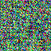
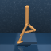

# Actively Predicting the Future

## Method: image()

The method takes the current latent state as input and imagine the future actions and observations iteratively. 
```
├── sheeprl
│   ├── sheeprl
│   │   ├── algos
│   │   │   ├── dreamer_v3
│   │   │   │   ├── dreamer_v3.py -> image()
```
To test this method, I train a DreamerV3 model for 45 mins (10000 policy steps) on the walker task of deepmind control suite, the predicted observations are as follows:

Policy Step 0 (Before Training):

<div align="center">
  <table>
    <tr>
      <td><br>Imagined Observation</td></td>
      <td><br>True Observation</td></td>
    </tr>
  </table>
</div>

Policy Step 10000 (After 45 Mins Training)
<div align="center">
  <table>
    <tr>
      <td><br>Imagined Observation</td></td>
      <td><br>True Observation</td></td>
    </tr>
  </table>
</div>

