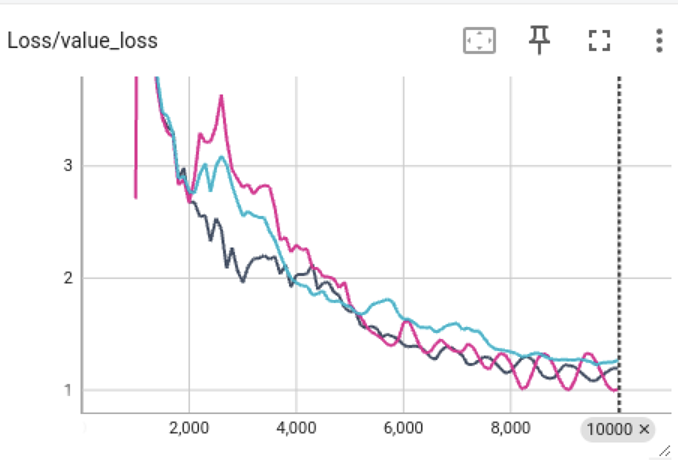
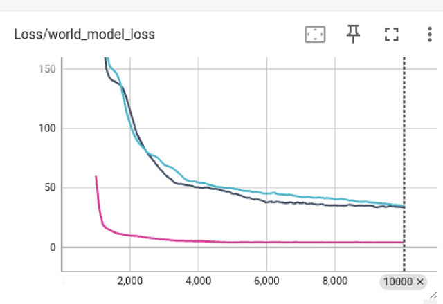
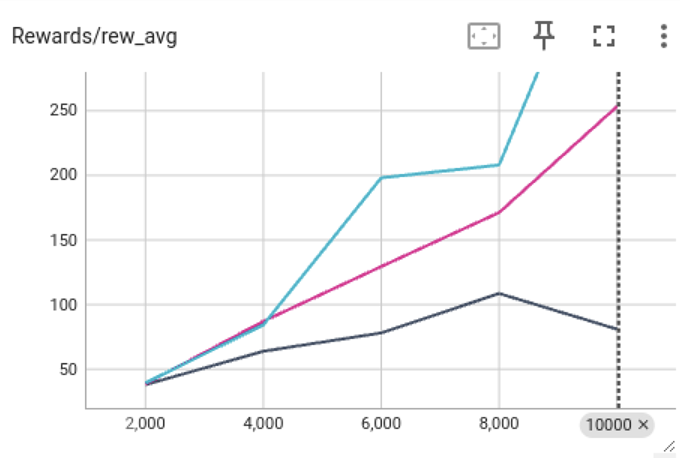
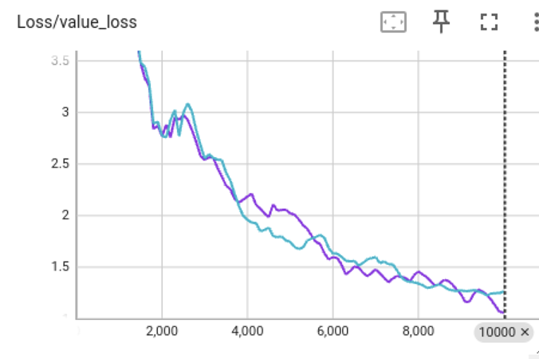
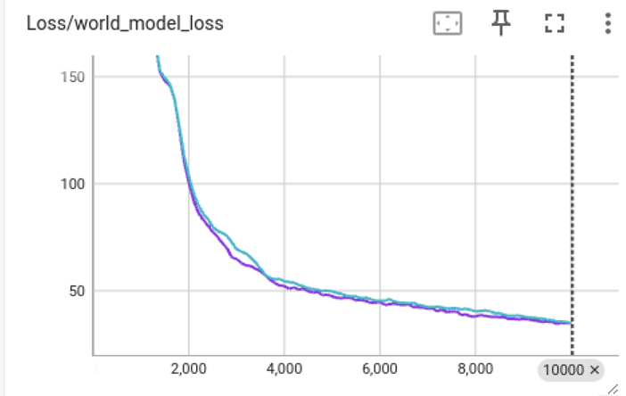
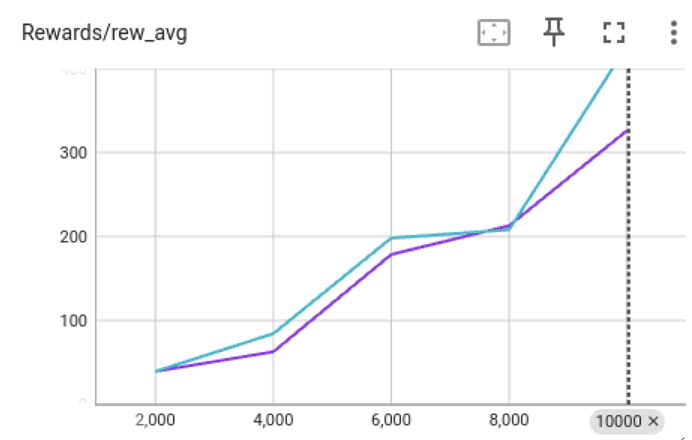

# ⚡ SheepRL 🐑

This repository is forked from [sheeprl](https://github.com/Eclectic-Sheep/sheeprl).

## Input Experiments

The algorithm is dreamer v3 and the environment is the walker from the Deepmind control suite. The configuration files I added are as follows, which contain the configurations for 3 different input: grayscale images, vector values, and both.
```
├── sheeprl
│   ├── exp_dreamer_v3_dmc.ipynb
│   ├── sheeprl
│   │   ├── configs
│   │   │   ├── exp
│   │   │   │   ├── dreamer_v3_dmc_walker_walk_vector.yaml
│   │   │   │   ├── dreamer_v3_dmc_walker_walk_grayscale.yaml
│   │   │   │   ├── dreamer_v3_dmc_walker_walk_grayscale_vector.yaml
```
In each experiment setting, the agent is trained for about 6 hours on my computer with RTX 2080.

The results are as follows:
<div align="center">
  <table>
    <tr>
      <td></td>
      <td></td>
      <td></td>
    </tr>
  </table>
</div>
where the dark blue curve is with grayscale images as input, the pink curve is with vector values as input and the light blue curve is with both as input.

The agent can move forward as:
<div align="center">
  <table>
    <tr>
      <td><br>Vector Values Input</td>
      <td><br>Grayscale Images Input</td>
      <td><br>Both Input</td>
    </tr>
  </table>
</div>
None of the algorithms have fully converged, and it is expected to take more than 24 hours of training for each if they are to fully converge.

## Attempt to Add New Input

The following files are created to add new input to the DMC environment:
```
├── sheeprl
│   ├── exp_dreamer_v3_dmc_extended.ipynb
│   ├── sheeprl
│   │   ├── configs
│   │   │   ├── env
│   │   │   │   ├── dmc_extended.yaml
│   │   │   ├── exp
│   │   │   │   ├── dreamer_v3_dmc_walk_walk_extended.yaml
│   │   ├── envs
│   │   │   ├── dmc_extended.py
```
The newly introduced input consists of the following 3: a random noise picture, a random scalar value, and the sum of the first values of the original image input and the scalar input.

## Decoder Input Experiment
The decoder inputs in the Input Experiments above were configured incorrectly, to fix this, configure the decoder inputs to the default latent representations in the following file:
```
├── sheeprl
│   ├── exp_dreamer_v3_dmc.ipynb
│   ├── sheeprl
│   │   ├── configs
│   │   │   ├── exp
│   │   │   │   ├── dreamer_v3_dmc_walker_walk_grayscale_vector_modified.yaml
```
The results are as follows:
<div align="center">
  <table>
    <tr>
      <td></td>
      <td></td>
      <td></td>
    </tr>
  </table>
</div>
where the light blue curve is with grayscale images and vector values as encoder input but with incorrect decoder input, the purple curve is with with grayscale images and vector values as encoder input and with default laten representations as decoder input.
